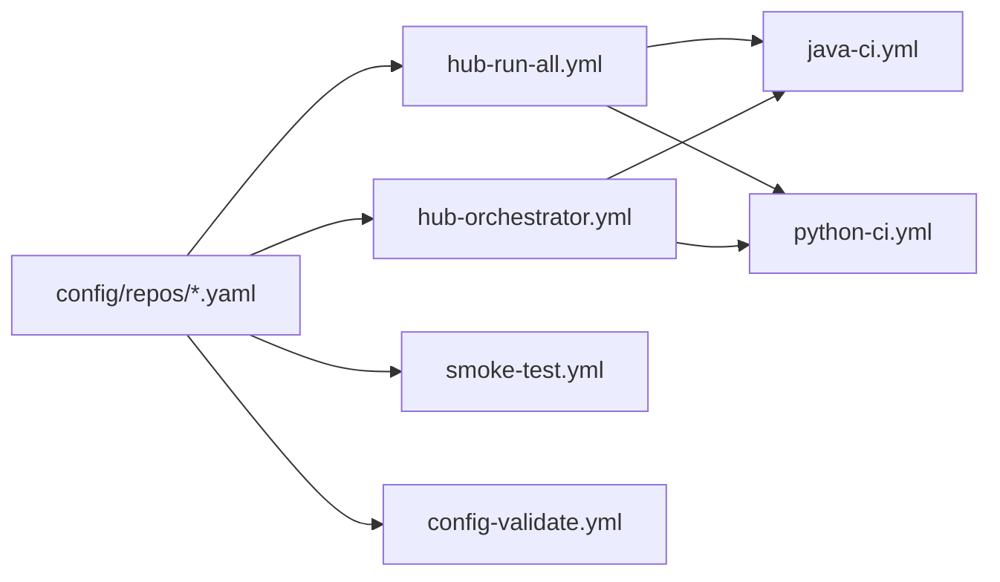

# CI/CD Hub

Centralized CI/CD for many repositories without copying workflow files into every project. The hub pulls configs from `config/repos/*.yaml`, runs quality and security tools for Java and Python, and publishes reports in one place.

## What You Get
- Single source of truth for pipelines and thresholds
- Central execution (hub clones repos) and optional dispatch (target repo runs reusable workflows)
- Monorepo support via `repo.subdir`
- Profiles and templates for fast, quality, security, minimal, coverage-gate, and compliance modes
- Schema-validated configs with defaults and opt-in heavy tools
- CLI (`cihub`) to generate `.ci-hub.yml` + `hub-ci.yml` and manage dispatch secrets
- Fixture repos for continuous smoke coverage

## Architecture



## Workflows

| Workflow               | Purpose                                                      | Trigger                                                                                               |
|------------------------|--------------------------------------------------------------|-------------------------------------------------------------------------------------------------------|
| `hub-run-all.yml`      | Central mode: clone each repo, run all tools, upload reports | workflow_dispatch; schedule (daily 02:00 UTC); push to main/master on `config/repos/*.yaml` changes   |
| `hub-orchestrator.yml` | Dispatch mode: trigger reusable workflows in target repos    | workflow_dispatch; schedule (daily 02:00 UTC); push to main/master on `config/**` or workflow changes |
| `hub-security.yml`     | Security & supply chain scans across repos                   | workflow_dispatch; schedule (weekly, Sun 03:00 UTC)                                                   |
| `smoke-test.yml`       | Sanity check fast profiles against fixture repos             | workflow_dispatch; PR on `config/repos/smoke-test-*.yaml` or workflow changes                         |
| `config-validate.yml`  | Validate `config/repos/*.yaml` against schema                | push/PR on `config/**`, `schema/**`, `scripts/load_config.py`, workflow; workflow_dispatch            |
| `hub-self-check.yml`   | Validate hub scripts/tests/templates/configs                 | push/PR on hub code paths; workflow_dispatch                                                          |
| `kyverno-validate.yml` | Validate hub Kyverno policies and templates                  | push/PR on `policies/kyverno/**` or `templates/kyverno/**`; workflow_dispatch                         |
| `release.yml`          | Create GitHub releases and manage version tags               | tag push `v*.*.*`                                                                                     |

### Reusable Workflows

External repos call these via `uses:` in their caller workflows:

| Workflow         | Purpose                                                             |
|------------------|---------------------------------------------------------------------|
| `java-ci.yml`    | Full Java CI: build, test, coverage, mutation, security scans       |
| `python-ci.yml`  | Full Python CI: pytest, coverage, mutation, linting, security scans |
| `kyverno-ci.yml` | Kubernetes policy validation (optional, for K8s deployments)        |

## Running the Hub (central mode)
```bash
# All repos
gh workflow run hub-run-all.yml -R jguida941/ci-cd-hub

# Only fixtures or smoke sets
gh workflow run hub-run-all.yml -R jguida941/ci-cd-hub -f run_group=fixtures
gh workflow run hub-run-all.yml -R jguida941/ci-cd-hub -f run_group=smoke

# Single repo
gh workflow run hub-run-all.yml -R jguida941/ci-cd-hub -f repos=java-spring-tutorials
```

### Dispatch mode (optional)
1) Create a PAT with scopes `repo` and `workflow`.  
2) Set it as `HUB_DISPATCH_TOKEN` (recommended: `python -m cihub setup-secrets --all`).  
3) In each target repo, generate the caller workflow:
   - `python -m cihub init --repo .` (creates `.ci-hub.yml` + `.github/workflows/hub-ci.yml`)  
4) Ensure `dispatch_enabled: true` in `config/repos/<repo>.yaml`. If the repo has `.ci-hub.yml`, its `dispatch_workflow` (default `hub-ci.yml`) is used; otherwise, set `dispatch_workflow: hub-ci.yml` in the hub config.  
5) Legacy callers `hub-java-ci.yml` / `hub-python-ci.yml` are still supported during migration; set `dispatch_workflow` accordingly if used.

## Adding a Repository
Create `config/repos/<name>.yaml`:
```yaml
repo:
  owner: jguida941
  name: ci-cd-hub-fixtures
  language: python
  default_branch: main
  subdir: python-passing          # optional for monorepos
  dispatch_enabled: false         # central mode only
  run_group: fixtures             # full | fixtures | smoke

python:
  version: "3.12"

thresholds:
  coverage_min: 70
  mutation_score_min: 70
```

## Fixtures and Smoke Tests
- Fixtures repo: `jguida941/ci-cd-hub-fixtures` with subdirs `python-passing`, `python-failing`, `python-with-docker`, `java-passing`, `java-failing`, `java-with-docker`.
- Smoke configs use `run_group: smoke`. Fixtures use `run_group: fixtures`.
- Use `run_group` input on `hub-run-all.yml` to avoid unintentionally running every set.

## Reports and Artifacts
- Report schema: `schema_version: "2.0"` with `tool_metrics` and `tools_ran` objects. Use `scripts/validate_report.sh` (`--stack python|java`, `--expect-clean|--expect-issues`) to validate `report.json`.
- Job names and artifacts include config basename and subdir to disambiguate duplicate repos.
- Uploaded artifacts include test results, coverage, mutation, dependency, static analysis, and Semgrep/Trivy outputs.
- Mutation testing:
  - Java: runs PITest across all modules containing the plugin; aggregates all `mutations.xml` files.
  - Python: runs mutmut with coverage-driven selection; reports killed/survived counts.

## Releases

The hub uses semantic versioning. To create a release:

```bash
# Tag a new version
git tag v1.0.0
git push origin v1.0.0

# This triggers release.yml which:
# 1. Validates reusable workflows with actionlint
# 2. Runs tests
# 3. Creates a GitHub Release
# 4. Updates floating major tag (v1 -> latest v1.x.x)
```

External repos should pin to the major version (e.g., `@v1`) for automatic minor/patch updates, or pin to exact version (e.g., `@v1.0.0`) for stability.

## Kyverno Policies (Optional)

For Kubernetes deployments, the hub includes Kyverno policies for runtime admission control:

| Policy                      | Purpose                             |
|-----------------------------|-------------------------------------|
| `block-pull-request-target` | Block dangerous GHA trigger         |
| `require-referrers`         | Require SBOM/provenance annotations |
| `secretless`                | Block static secrets, enforce OIDC  |
| `verify-images`             | Verify Cosign keyless signatures    |

Use the reusable `kyverno-ci.yml` workflow to validate your policies:

```yaml
jobs:
  kyverno:
    uses: jguida941/ci-cd-hub/.github/workflows/kyverno-ci.yml@v1
    with:
      policies_dir: 'policies/kyverno'
      run_tests: true
```

See `docs/adr/0012-kyverno-policies.md` for details.

## Documentation
Documentation is under `docs/` with the structure:
```
docs/
├── guides/        # ONBOARDING, WORKFLOWS, MODES, MONOREPOS, DISPATCH_SETUP, TROUBLESHOOTING
├── reference/     # CONFIG_REFERENCE, TOOLS, example.ci-hub.yml
├── development/   # ROADMAP, RESEARCH, SMOKE_TEST*, audit
├── adr/           # Architecture decisions
└── README.md      # Docs index
```

Start with `docs/guides/ONBOARDING.md`, `docs/guides/WORKFLOWS.md`, and `docs/reference/CONFIG_REFERENCE.md`.

## Development

```bash
# Clone and setup
git clone https://github.com/jguida941/ci-cd-hub.git
cd ci-cd-hub

# Create virtual environment
python3 -m venv .venv
source .venv/bin/activate  # On Windows: .venv\Scripts\activate

# Install dependencies
pip install -r requirements-dev.txt  # Core + dev (pytest, ruff)
# OR: pip install -r requirements.txt  # Core only

# Run tests
pytest tests/

# Lint
ruff check .
```

## License

CI-CD Hub is licensed under the [Elastic License 2.0](LICENSE).

See the `LICENSE` file for details.
Use for personal, internal, or evaluation purposes only.
Commercial or third-party use requires permission.

## Support
Open issues in `ci-cd-hub` with run URLs and the config file you used. Include whether you ran central (`hub-run-all.yml`) or dispatch (`hub-orchestrator.yml`).
