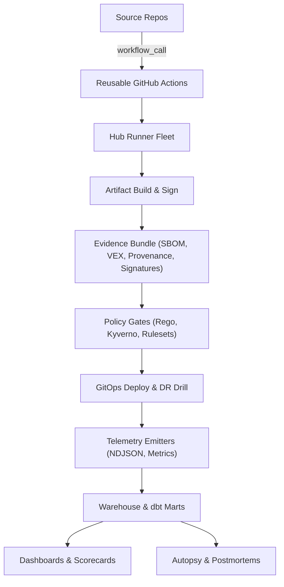
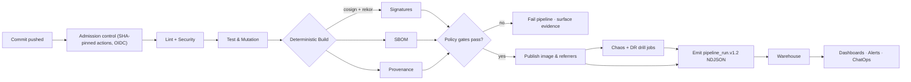

# CI Intelligence Hub

[LICENSE](LICENSE) · [Security](docs/SECURITY.md)

> Production-grade CI/CD intelligence platform that hardens the software supply chain, proves determinism, and converts pipeline telemetry into executive-grade analytics—implemented according to the blueprint in `plan.md`.

This README gives engineers, auditors, and downstream repos an actionable entry point: how to run the core checks, what the platform guarantees, which components are stable, and where to find every artifact referenced in the plan.

## Quick start

```bash
# 1) Setup
python -m pip install -r requirements-dev.txt
make help

# 2) Run core checks locally
make lint           # Ruff security rules + Bandit + pip-audit + workflow guard
make test           # pytest for tools/*

# 3) Simulate a pipeline run with evidence
make run-chaos
make run-dr
python scripts/emit_pipeline_run.py --output artifacts/pipeline_run.ndjson

# 4) Validate evidence
./tools/rekor_monitor.sh sha256:... ghcr.io/<owner>/<image> artifacts/evidence/rekor
./tools/determinism_check.sh ghcr.io/<owner>/<image>@sha256:... artifacts/evidence/determinism
ajv validate -s schema/pipeline_run.v1.2.json -d artifacts/pipeline_run.ndjson
```

## Prerequisites

| Requirement | Version (tested) | Purpose |
| --- | --- | --- |
| Python | 3.12.1 (min 3.11) | Tooling CLI entrypoints and tests |
| pip | ≥ 24.0 | Dependency installation |
| Docker / OCI runtime | 24.x | Build and verify release images |
| GitHub Actions | Org with reusable workflows enabled | Hosted execution environment |
| jq | ≥ 1.6 | JSON processing inside scripts |
| yq | ≥ 4.40 | YAML normalization for policy prep |
| oras | ≥ 1.0.0 | Discover OCI referrers for SBOM/VEX |
| cosign | ≥ 2.4.0 | Signature and provenance verification |
| syft | ≥ 1.15.0 | SBOM generation |
| grype | ≥ 0.75.0 | Vulnerability scanning |
| dbt-core | 1.7.x | Build analytics marts (`models/`) |

**Optional tooling**: Kyverno CLI (1.10+), OPA (0.60+), AJV CLI (8.11+), GNU Make (4.3+), GNU tar (1.34+), rekor-cli (v1.3.1 auto-installed by `tools/rekor_monitor.sh` if absent).

## Strategic pillars

- **Trust** — Signed, attestable, reproducible builds; Kyverno admission control; SBOM/VEX gates; secretless automation.
- **Reliability** — Deterministic build harnesses, DR drills, chaos engineering, cache integrity, and runner isolation.
- **Insight** — NDJSON telemetry, dbt marts, dashboards, and ChatOps loops for DORA, resilience, cost, and quality.
- **Efficiency** — Predictive scheduling, cache hygiene, carbon/cost tracking, reusable workflow templates.

## Technology stack

| Layer | Tooling | Notes |
| --- | --- | --- |
| Languages | Python 3.12, Bash, YAML, Rego | Python modules under `tools/`, Bash utilities in `tools/` and `scripts/`, policy packs in `policies/`. |
| CI/CD | GitHub Actions reusable workflows | Workflows live in `.github/workflows/`, invoked via `workflow_call` (planned hub entrypoint). |
| Supply-chain | Cosign, Rekor, oras, syft, grype | Used in `release.yml` and supporting scripts for SBOM/VEX/provenance sign-off. |
| Policy | Kyverno, OPA/Rego | Kyverno bundles under `policies/kyverno/`, Rego policies in `policies/*.rego`. |
| Data | dbt-core, BigQuery-compatible NDJSON | dbt project in `models/`, ingestion scripts in `ingest/` and `scripts/`. |
| Testing & QA | pytest, Ruff, Bandit, pip-audit, CodeQL | Executed via `make` targets and workflows like `unit.yml`, `security-lint.yml`, `codeql.yml`. |

## Security boundaries & claims

- **Guarantees**: Workflows pinned by SHA; OIDC-only credentials; SBOM, VEX, provenance, and signatures emitted for release artifacts; Rego + Kyverno policy evaluation blocks promotion lacking evidence; telemetry must satisfy `schema/pipeline_run.v1.2.json` before ingest. Alignment target: **SLSA Level 3**.
- **Non-guarantees**: Downstream cluster runtime isolation, tenant secrets managed outside hub runners, third-party GitHub Action supply chain beyond pinned commits, runtime service hardening post-deploy.
- **Proof required for SLSA L3 assertion**: Cosign verification logs, Rekor inclusion proof, signed SBOM/VEX, determinism check outputs, cache manifest signatures, and policy evaluation results—all stored in the Evidence Bundle (`artifacts/evidence/`).

## Delivery roadmap (see `plan.md`)

| Phase | Outcome snapshot | Primary enablers |
| --- | --- | --- |
| 0 — Alignment | Personas, KPIs, dashboard guardrails locked | Executive charter, metric catalog |
| 1 — Hermetic build path + CD essentials | Signed artifacts, determinism checks, reusable workflows, OIDC-only identity | `tools/rekor_monitor.sh`, `tools/determinism_check.sh`, Kyverno + Rego packs |
| 2 — Ingestion & storage | Structured telemetry landing zone, schema enforcement, expanded quality gates | `scripts/emit_pipeline_run.py`, `schema/pipeline_run.v1.2.json`, dbt marts (`models/`) |
| 3 — Policy, gates & analytics | Admission policies, SBOM/VEX enforcement, dashboards, fuzz/perf budgets | `policies/`, `dashboards/`, `make/lint.mk`, `scripts/test_kyverno_policies.py` |
| 4 — Reliability hardening & chaos | Chaos drills, runner isolation, cache poisoning defenses | `make/chaos.mk`, `make/dr.mk`, `fixtures/cache_sentinel/` |
| 5 — Advanced analytics | Predictive insights, executive scorecards, optional gamification | `dashboards/`, `models/marts/`, `ui/` (planned portal) |

### Phase definition of done

| Phase | DoD |
| --- | --- |
| 1 | Reproducible build harness green; SBOM/VEX/provenance emitted; policy gate denies missing referrers; Evidence Bundle uploaded. |
| 2 | NDJSON landing + schema CI green; dbt staging builds clean; marts populated on sample data. |
| 3 | Kyverno/OPA deny-path tests green; dashboards render with ≥ 1 week of data. |
| 4 | Chaos/DR jobs produce artifacts and pass replay checks. |
| 5 | Predictive scheduler outputs stable insights; error budgets tracked. |

## Support & status

| Area | Status | Notes |
| --- | --- | --- |
| Workflow guard (pinned SHAs, OIDC) | Working | `scripts/check_workflow_integrity.py` |
| SBOM/VEX gate | Working | syft + grype → `tools/build_vuln_input.py` |
| Rekor monitor | Working | `tools/rekor_monitor.sh` |
| Determinism harness | Beta | `tools/determinism_check.sh` (dual-run automation WIP) |
| Kyverno bundles | Beta | `policies/kyverno/`; cluster integration docs forthcoming |
| dbt marts | Beta | `models/` builds run; refresh cadence TBD |
| Chaos/DR drills | Alpha | `make run-chaos`, `make run-dr` produce fixtures; expand scenarios |
| UI/Portal | Planned | `ui/` scaffold only |

## GitHub Actions suite

| Workflow | Purpose | Key jobs |
| --- | --- | --- |
| `.github/workflows/unit.yml` | Runs unit tests for the Python toolchain | `pytest` over `tools/tests/`, coverage artifacts |
| `.github/workflows/security-lint.yml` | Enforces workflow pinning, Ruff security rules, Bandit, pip-audit | Security guard rails before merge |
| `.github/workflows/mutation.yml` | Executes Mutation Observatory | Aggregates `stryker`/`mutmut` reports into NDJSON/Markdown |
| `.github/workflows/chaos.yml` | Simulates chaos scenarios | Produces artifacts under `artifacts/chaos/` |
| `.github/workflows/dr-drill.yml` | Runs disaster-recovery drills | Emits DR evidence under `artifacts/dr/` |
| `.github/workflows/schema-ci.yml` | Validates schema compliance | Uses `scripts/validate_schema.py` and AJV |
| `.github/workflows/release.yml` | Builds, signs, and publishes artifacts | SBOM, VEX, provenance, Rekor proof generation |
| `.github/workflows/rekor-monitor.yml` | Monitors Rekor inclusion proofs | Keeps evidence fresh post-release |
| `.github/workflows/sign-digest.yml` | Repairs unsigned images | Invoked manually to backfill signatures |
| `.github/workflows/tools-ci.yml` | Lints/tests the tooling package | Ensures `tools/` CLI coverage |
| `.github/workflows/codeql.yml` | Static analysis via CodeQL | Language-specific security scanning |

## Minimal reusable workflow (consumer repo)

A reusable workflow will ship from this repo (planned location: `.github/workflows/hub.yml`). Downstream consumers can invoke it like so:

```yaml
# .github/workflows/ci-intel.yml
name: CI Intelligence Hub
on:
  workflow_call:
    inputs:
      image:
        required: true
        type: string
permissions:
  id-token: write
  contents: read
jobs:
  run-hub:
    uses: org/ci-intelligence-hub/.github/workflows/hub.yml@<pinned-sha>  # planned export
    with:
      image: ${{ inputs.image }}
```

## Evidence bundle layout

```text
artifacts/evidence/
├── sbom.json
├── vex.json
├── slsa-provenance.json
├── rekor/
│   └── entry.json
├── determinism/
│   ├── build-A/
│   ├── build-B/
│   └── diff.txt
├── cache/
│   ├── manifest.json
│   └── signature.sig
└── audit/
    └── commands.log
```

**Pass criteria**: SBOM + VEX present, Cosign attestation verifies with OIDC issuer match, determinism diff empty, Rekor inclusion proof recorded, cache manifest signed, policy gates return `allow`. Capture command transcripts in `artifacts/evidence/audit/commands.log`.

## Repository layout

### High-level topology

```text
.
├── plan.md
├── docs/                ← Architecture, runbooks, agent catalog, metrics
├── make/                ← Composable make targets (lint, chaos, DR, docs, vuln)
├── scripts/             ← Python CLIs for policy prep, ingest, schema validation
├── tools/               ← Core CLIs/agents (cache sentinel, chaos, Rekor, VEX)
├── policies/            ← Rego/Kyverno enforcement packs + tests
├── fixtures/            ← SBOM/VEX samples, Kyverno fixtures, mutation reports
├── models/              ← dbt project, marts, staging models, tests
├── dashboards/          ← Analytics definitions (JSON)
├── data/                ← Sample NDJSON/DR artifacts
├── artifacts/           ← Generated evidence (chaos, DR, security scans, provenance)
├── config/              ← Shared CI configs (mutation observatory, project registry)
├── chaos/, data-quality-and-dr/, determinism-and-repro/ ← Scenario scripts & docs
├── supply-chain-enforce/ ← Kyverno profile exported for clusters
├── emitters/ (planned)  ← Telemetry emitter scaffolding
├── agent/ (planned)     ← Future orchestrator services
├── apps/github-app/ (planned) ← Placeholder for ChatOps GitHub App
├── deploy/ (planned)    ← GitOps integration playbooks
├── services/ (planned)  ← Long-running services (policy gateway, replay)
├── ui/ (planned)        ← Analytics/portal UI scaffold
└── pyproject.toml, requirements-*.txt, ruff.toml, Dockerfile, Makefile
```

### Directory reference

| Path | Purpose | Representative assets |
| --- | --- | --- |
| `plan.md` | Canonical thesis, phased roadmap, control catalog | Gap tracker, phase objectives, control snippets |
| `docs/` | Human-facing documentation | `docs/OVERVIEW.md`, `docs/AGENTS.md`, `docs/SECURITY.md`, modules under `docs/modules/` |
| `agent/` (planned) | Orchestration services scaffold | Will host aggregated agent runners |
| `apps/github-app/` (planned) | Future GitHub App implementation | ChatOps integration per plan |
| `artifacts/` | Generated evidence and reports | Chaos/DR NDJSON, security scan outputs, `artifacts/slsa-provenance.json` |
| `autopsy/` | Log-analysis utilities | `autopsy/analyzer.py`, `autopsy/tests/test_analyzer.py` |
| `chaos/` | Chaos scenario definitions | `chaos/chaos-fixture.json` consumed by `make run-chaos` |
| `config/` | Shared CI configs | `config/mutation-observatory.ci.yaml`, `config/projects.yaml` |
| `dashboards/` | JSON analytics dashboards | `dashboards/mutation_effectiveness.json`, `dashboards/run_health.json` |
| `data/` | Sample datasets & DR bundles | `data/dr/manifest.json`, NDJSON samples |
| `data-quality-and-dr/` | DR validation scripts | `data-quality-and-dr/dr_recall.sh` |
| `deploy/` (planned) | Deployment playbooks | Will back GitOps repo |
| `determinism-and-repro/` | Determinism tooling staging | Supports Phase 1 DoD, docs forthcoming |
| `docs/modules/` | Deep dives on each tool | `cache_sentinel.md`, `mutation_observatory.md`, etc. |
| `emitters/` (planned) | Telemetry emitters | Additional ingestion agents |
| `evidence/` | Evidence bundle staging area | Populated during release workflows |
| `fixtures/` | Test + policy fixtures | Kyverno failing cases, sample SBOM/VEX, mutation outputs |
| `ingest/` | Telemetry ETL | `ingest/event_loader.py`, `ingest/chaos_dr_ingest.py` |
| `logs/` | Run logs | `logs/dbt.log` |
| `make/` | Modular make logic | `make/lint.mk`, `make/chaos.mk`, `make/dr.mk`, `make/vex.mk` |
| `models/` | dbt project for analytics marts | `models/marts/*.sql`, `models/tests/data_quality.yml` |
| `pkg/` (planned) | Packaging scaffold | Future OCI/PyPI artifacts |
| `policies/` | Rego/Kyverno packs | `policies/issuer_subject.rego`, `policies/tests/*.rego` |
| `schema/` | JSON Schema + registry | `schema/pipeline_run.v1.2.json`, `schema/cyclonedx-vex-1.5.schema.json` |
| `scripts/` | Operational Python entrypoints | `scripts/check_workflow_integrity.py`, `scripts/emit_pipeline_run.py` |
| `services/` (planned) | Long-lived services | Policy gateway & replay services |
| `supply-chain-enforce/` | Kyverno bundles for clusters | `supply-chain-enforce/kyverno/verify-images.yaml` |
| `tools/` | Shipping-grade CLIs & agents | `tools/cache_sentinel.py`, `tools/rekor_monitor.sh`, `tools/mutation_observatory.py`, pytest suite `tools/tests/` |
| `ui/` (planned) | Portal workspace | Becomes analytics UI in Phase 5 |

## System diagrams

### Control plane relationships



### Pipeline flow (Phase 1–2)



## Pipeline walkthrough

- **Admission** — GitHub Rulesets plus `scripts/check_workflow_integrity.py` enforce pinned SHAs, OIDC-only identity, and secret sweeps.
- **Build & sign** — `tools/build_vuln_input.py`, `tools/export_provenance_envelope.py`, and `tools/publish_referrers.sh` generate SBOMs/VEX, provenance, and attach OCI referrers.
- **Determinism** — `tools/determinism_check.sh` runs dual-build comparisons (see `plan.md` Phase 1).
- **Evidence** — `tools/rekor_monitor.sh` and `artifacts/evidence/` capture Rekor proofs, signature envelopes, cache manifests, determinism diffs.
- **Policy enforcement** — Rego bundles under `policies/` and Kyverno definitions under `policies/kyverno/` enforce issuer/subject allowlists, SBOM coverage, and secretless deployments; tests run via `scripts/test_kyverno_policies.py`.
- **Release & DR** — `make run-chaos` and `make run-dr` execute controlled experiments; outputs land in `artifacts/chaos/` and `artifacts/dr/` for auditing.
- **Telemetry & analytics** — `scripts/emit_pipeline_run.py` emits NDJSON validated against `schema/pipeline_run.v1.2.json`; dbt models in `models/` publish `mutation_effectiveness` and `run_health` marts feeding dashboards.

## Operational commands & audit log

- **OCI referrers present**  
  Command:

  ```bash
  oras discover "$IMAGE" --artifact-type application/spdx+json
  oras discover "$IMAGE" --artifact-type application/vnd.in-toto+json
  ```

  Expected evidence: Both commands locate digests; failure blocks deploy.

- **Provenance verification**  
  Command:

  ```bash
  cosign verify-attestation --type slsaprovenance \
    --certificate-oidc-issuer-regex 'https://token.actions.githubusercontent.com' \
    "$IMAGE"
  ```

  Expected evidence: Cosign exits 0; issuer matches org OIDC.

- **SBOM + VEX policy**  
  Command:

  ```bash
  grype sbom:sbom.json -q -o json \
    | ./tools/build_vuln_input.py --vex vex.json \
    | jq -e '.policy.allow==true'
  ```

  Expected evidence: Pipeline proceeds when policy allows release.

- **Schema compliance**  
  Command:

  ```bash
  jq -e 'select(.schema != "pipeline_run.v1.2") | halt_error(1)' artifacts/pipeline_run.ndjson
  ajv validate -s schema/pipeline_run.v1.2.json -d artifacts/pipeline_run.ndjson
  ```

  Expected evidence: NDJSON matches schema; AJV exit 0.

- **Secretless workflows**  
  Command:

  ```bash
  ! grep -R -E 'AWS_SECRET|_KEY=|TOKEN=' -n .github/workflows
  ```

  Expected evidence: Grep exits 0 with no matches.

- **Kyverno policy regression**  
  Command:

  ```bash
  python scripts/test_kyverno_policies.py
  ```

  Expected evidence: Deny-path unit tests for `require-referrers` and `secretless`.

- **Cache manifest integrity**  
  Command:

  ```bash
  python tools/cache_sentinel.py record --path ~/.cache/pip
  python tools/cache_sentinel.py verify --path ~/.cache/pip
  ```

  Expected evidence: Signed manifest in `artifacts/evidence/cache/`.

- **dbt pipeline health**  
  Command:

  ```bash
  python scripts/run_dbt.py build
  ```

  Expected evidence: dbt logs at `models/logs/dbt.log`; failures gate merges.

Log command transcripts to `artifacts/evidence/audit/commands.log` to maintain evidentiary trail.

## Local development workflow

1. **Bootstrap Python tooling**

   ```bash
   python -m pip install --upgrade pip
   python -m pip install -r requirements-dev.txt
   python -m pip install -r requirements-dev.lock
   ```

2. **Discover available automation**

   ```bash
   make help
   ```

3. **Static analysis & policy checks**

   ```bash
   make lint
   python scripts/check_workflow_integrity.py
   ```

4. **Run test harnesses**

   ```bash
   make test
   make run-chaos
   make run-dr
   ```

5. **Generate VEX / policy inputs**

   ```bash
   python tools/generate_vex.py --sbom artifacts/evidence/sbom.json --output vex.json
   python scripts/prepare_policy_inputs.py --referrers fixtures/supply_chain/referrers.json \
      --issuer fixtures/supply_chain/issuer_subject.json --output policy-inputs/
   ```

## Key `make` targets

| Target | File | Description |
| --- | --- | --- |
| `make lint` | `make/lint.mk` | Markdown + security lint (Ruff S rules, Bandit, pip-audit, workflow guard). |
| `make test` | `make/tests.mk` | Runs `pytest` suite under `tools/tests/`. |
| `make run-chaos` | `make/chaos.mk` | Executes chaos simulator writing to `artifacts/chaos/`. |
| `make run-dr` | `make/dr.mk` | Runs DR drill simulator emitting NDJSON/JSON artifacts. |
| `make dbt` | `make/lint.mk` | Invokes `scripts/run_dbt.py build` for analytics pipeline. |
| `make clean-*` | `make/clean.mk` | Removes generated artifacts per domain (chaos, DR, cache, etc.). |
| `make docs` | `make/docs.mk` | Builds documentation site (MkDocs) when configured. |

## Data & analytics spine

- **Ingestion** — `scripts/record_job_telemetry.py` and `ingest/event_loader.py` load NDJSON into the staging layer.
- **Schema** — `schema/registry.json` governs payloads; `schema/pipeline_run.v1.2.json` enforced by CI.
- **Modeling** — `models/staging/` prepares canonical tables; `models/marts/mutation_effectiveness.sql` and `run_health.sql` publish executive marts.
- **Dashboards** — `dashboards/` JSON definitions feed Superset/Looker deployments referenced in `plan.md`.
- **Logs & postmortem** — `docs/POSTMORTEM.md` and `autopsy/` tooling support incident analysis; `docs/DR_RUNBOOK.md` and `docs/OPS_RUNBOOK.md` cover operations.

## Documentation map

- [`docs/OVERVIEW.md`](docs/OVERVIEW.md) — architecture narrative + metadata.
- [`docs/AGENTS.md`](docs/AGENTS.md) — agent catalog (purpose, triggers, outputs).
- [`docs/SECURITY.md`](docs/SECURITY.md) — supply-chain posture and reviewer checklist.
- [`docs/OPS_RUNBOOK.md`](docs/OPS_RUNBOOK.md) & [`docs/DR_RUNBOOK.md`](docs/DR_RUNBOOK.md) — on-call and DR playbooks.
- [`docs/TESTING.md`](docs/TESTING.md) — local testing expectations, coverage, schema CI.
- [`docs/SUPPLY_CHAIN.md`](docs/SUPPLY_CHAIN.md) — SBOM/provenance gate details.
- [`docs/TODO.md`](docs/TODO.md) — documentation follow-ups.

## Contributing & support

- Read [`docs/CONTRIBUTING.md`](docs/CONTRIBUTING.md) for branching, coding style, and review expectations.
- Security issues follow the disclosure guidance in [`docs/SECURITY.md`](docs/SECURITY.md).
- Operational questions start with [`docs/OPS_RUNBOOK.md`](docs/OPS_RUNBOOK.md); analytics/data issues with [`docs/DR_RUNBOOK.md`](docs/DR_RUNBOOK.md) and `docs/metrics.md`.
- Use `make help` to discover additional automation, and open issues with structured evidence bundles for reproducibility.

## Evidence bundle expectations

- Store SBOM, VEX, provenance, signatures, Rekor proof, cache manifest, determinism diff, and promote/rollback decisions under `artifacts/evidence/`.
- Include audit command transcripts at `artifacts/evidence/audit/commands.log`.
- Link bundle artifacts in change-management tickets to satisfy Trust & Compliance objectives in `plan.md`.

## License

Distributed under the [MIT License](LICENSE).

---

For full context, read `plan.md` alongside the runbooks in `docs/`. This README stays synchronized with the blueprint so every stakeholder can reason about the CI Intelligence Hub end-to-end.
