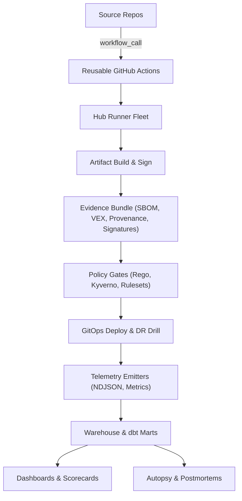
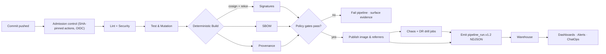

# CI Intelligence Hub

[LICENSE](LICENSE) · [Security](docs/SECURITY.md)

> Production-grade CI/CD intelligence platform that hardens the software supply chain, proves determinism, and converts pipeline telemetry into executive-grade analytics—implemented according to the blueprint in `plan.md`.
>
> **Current status (2025-11-02)**: ~85 % ready for trusted single-repository use on GitHub-hosted runners. Multi-repository hub features (per-repo secrets, rate limiting, cost tracking) remain in progress. Proxy-based egress controls need validation in CI, and cross-time determinism is a post-release audit, not a merge gate.
>
> **Use in production only after**: confirming egress enforcement in real runs, deploying Kyverno policies to the target cluster, and implementing the Phase 2 roadmap in `MULTI_REPO_IMPLEMENTATION_STATUS.md`. Track real-time readiness in [`HONEST_STATUS.md`](docs/status/honest-status.md).
This README gives engineers, auditors, and downstream repos an actionable entry point: how to run the core checks, what the platform guarantees, which components are stable, and where to find every artifact referenced in the plan.

## Quick start

```bash
# 1) Setup
python -m pip install -r requirements-dev.txt
make help

# 2) Run core checks locally
make lint           # Ruff security rules + Bandit + pip-audit + workflow guard
make test           # pytest for tools/*

# 3) Simulate a pipeline run with evidence
make run-chaos
make run-dr
python scripts/emit_pipeline_run.py --output artifacts/pipeline_run.ndjson

# 4) Build analytics marts
python scripts/run_dbt.py build

# 5) Validate evidence
./tools/rekor_monitor.sh sha256:... ghcr.io/<owner>/<image> artifacts/evidence/rekor
./tools/determinism_check.sh ghcr.io/<owner>/<image>@sha256:... artifacts/evidence/determinism
ajv validate -s schema/pipeline_run.v1.2.json -d artifacts/pipeline_run.ndjson
```

## Prerequisites

| Requirement | Version (tested) | Purpose |
| --- | --- | --- |
| Python | 3.12.1 (min 3.10) | Tooling CLI entrypoints and tests |
| pip | ≥ 24.0 | Dependency installation |
| Docker / OCI runtime | 24.x | Build and verify release images |
| GitHub Actions | Org with reusable workflows enabled | Hosted execution environment |
| jq | ≥ 1.6 | JSON processing inside scripts |
| yq | ≥ 4.40 | YAML normalization for policy prep |
| oras | ≥ 1.0.0 | Discover OCI referrers for SBOM/VEX |
| cosign | ≥ 2.2.4 | Signature and provenance verification |
| syft | ≥ 1.15.0 | SBOM generation |
| grype | ≥ 0.102.0 | Vulnerability scanning |
| crane | ≥ 0.19.0 | Tag/digest verification & registry queries |
| dbt-core | 1.10.x | Build analytics marts (`models/`) |

**Optional tooling**: Kyverno CLI (1.10+), OPA (0.60+), AJV CLI (8.11+), GNU Make (4.3+), GNU tar (1.34+), rekor-cli (v1.3.1 auto-installed by `tools/rekor_monitor.sh` if absent), act (latest; local GitHub Actions emulation).

## Strategic pillars

- **Trust** — Signed, attestable, reproducible builds; Kyverno admission control; SBOM/VEX gates; secretless automation.
- **Reliability** — Deterministic build harnesses, DR drills, chaos engineering, cache integrity, and runner isolation.
- **Insight** — NDJSON telemetry, dbt marts, dashboards, and ChatOps loops for DORA, resilience, cost, and quality.
- **Efficiency** — Predictive scheduling, cache hygiene, carbon/cost tracking, reusable workflow templates.

## Technology stack

| Layer | Tooling | Notes |
| --- | --- | --- |
| Languages | Python 3.12, Bash, YAML, Rego | Python modules under `tools/`, Bash utilities in `tools/` and `scripts/`, policy packs in `policies/`. |
| CI/CD | GitHub Actions reusable workflows | Workflows live in `.github/workflows/`, invoked via `workflow_call` (planned hub entrypoint). |
| Supply-chain | Cosign, Rekor, oras, syft, grype | Used in `release.yml` and supporting scripts for SBOM/VEX/provenance sign-off. |
| Policy | Kyverno, OPA/Rego | Kyverno bundles under `policies/kyverno/`, Rego policies in `policies/*.rego`. |
| Data | dbt-core, BigQuery-compatible NDJSON | dbt project in `models/`, ingestion scripts in `ingest/` and `scripts/`. |
| Testing & QA | pytest, Ruff, Bandit, pip-audit, CodeQL | Executed via `make` targets and workflows like `unit.yml`, `security-lint.yml`, `codeql.yml`. |

## Current multi-repo capabilities (v1.0.10 snapshot)

| Area | Status | Notes |
| --- | --- | --- |
| Repository registry | ✅ Implemented | `config/repositories.yaml` + `scripts/load_repository_matrix.py` drive the matrix. |
| Per-repo egress allowlists | 🟡 Implemented, pending validation | HTTP-aware tooling is forced through a proxy wrapper; run a CI job to confirm black-hole behaviour for unauthorized domains. |
| Per-repo timeouts | 🟡 Implemented | `timeout` enforces `settings.build_timeout`; job-level `timeout-minutes` remains global (60 min). |
| Per-repo concurrency limits | ❌ Not supported on hosted runners | `settings.max_parallel_jobs` is parsed but GitHub Actions applies `strategy.max-parallel` globally. |
| Memory limits | ❌ Not supported on hosted runners | `settings.resource_limit_mb` is informational only. |
| Cross-time determinism | 🟡 Post-release audit | The follow-up workflow files issues on drift; gating still required. |
| Secrets, rate limiting, cost tracking | 🚧 Planned | See `MULTI_REPO_IMPLEMENTATION_STATUS.md` Phase 2 roadmap. |

## Security boundaries & claims

- **Guarantees**: Workflows pinned by SHA; OIDC-only credentials; SBOM, VEX, provenance, and signatures emitted for release artifacts; proxy-based egress allowlists applied to all HTTP-aware tooling; telemetry must satisfy `schema/pipeline_run.v1.2.json` before ingest. Alignment target: **SLSA Level 3**.
- **Non-guarantees (yet)**: Downstream cluster runtime isolation, per-repository secrets, GitHub Actions proxy coverage for tools that do not honour `HTTP(S)_PROXY`, third-party GitHub Action supply chain beyond pinned commits, runtime service hardening post-deploy.
- **Controls running in CI but not yet enforced in production**: Kyverno/OPA policy evaluation (`scripts/verify_kyverno_enforcement.sh`) runs as evidence but policies are not deployed to the target cluster; cross-time determinism is monitored post-release via `.github/workflows/cross-time-determinism.yml`.
- **Proof required for SLSA L3 assertion**: Cosign verification logs, Rekor inclusion proof, signed SBOM/VEX, determinism check outputs, cache manifest signatures, and policy evaluation results—all stored in the Evidence Bundle (`artifacts/evidence/`).

## Delivery roadmap (see `plan.md`)

| Phase | Outcome snapshot | Primary enablers |
| --- | --- | --- |
| 0 — Alignment | Personas, KPIs, dashboard guardrails locked | Executive charter, metric catalog |
| 1 — Hermetic build path + CD essentials | Signed artifacts, determinism checks, reusable workflows, OIDC-only identity | `tools/rekor_monitor.sh`, `tools/determinism_check.sh`, Kyverno + Rego packs |
| 2 — Ingestion & storage | Structured telemetry landing zone, schema enforcement, expanded quality gates | `scripts/emit_pipeline_run.py`, `schema/pipeline_run.v1.2.json`, dbt marts (`models/`) |
| 3 — Policy, gates & analytics | Admission policies, SBOM/VEX enforcement, dashboards, fuzz/perf budgets | `policies/`, `dashboards/`, `make/lint.mk`, `scripts/test_kyverno_policies.py` |
| 4 — Reliability hardening & chaos | Chaos drills, runner isolation, cache poisoning defenses | `make/chaos.mk`, `make/dr.mk`, `fixtures/cache_sentinel/` |
| 5 — Advanced analytics | Predictive insights, executive scorecards, optional gamification | `dashboards/`, `models/marts/`, `ui/` (planned portal) |

### Phase definition of done

| Phase | DoD |
| --- | --- |
| 1 | Reproducible build harness green; SBOM/VEX/provenance emitted; policy gate denies missing referrers; Evidence Bundle uploaded. |
| 2 | NDJSON landing + schema CI green; dbt staging builds clean; marts populated on sample data. |
| 3 | Kyverno/OPA deny-path tests green; dashboards render with ≥ 1 week of data. |
| 4 | Chaos/DR jobs produce artifacts and pass replay checks. |
| 5 | Predictive scheduler outputs stable insights; error budgets tracked. |

## Support & status

| Area | Status | Notes |
| --- | --- | --- |
| Workflow guard (pinned SHAs, OIDC) | Working | `scripts/check_workflow_integrity.py` |
| SBOM/VEX gate | Working | syft + grype → `tools/build_vuln_input.py` |
| Rekor monitor | Working | `tools/rekor_monitor.sh` |
| Determinism harness | Beta | `tools/determinism_check.sh` (dual-run automation WIP) |
| Kyverno bundles | Beta | `policies/kyverno/`; cluster integration docs forthcoming |
| dbt marts | Beta | `models/` builds run; refresh cadence TBD |
| Chaos/DR drills | Alpha | `make run-chaos`, `make run-dr` produce fixtures; expand scenarios |
| UI/Portal | Planned | `ui/` scaffold only |

## GitHub Actions suite

| Workflow | Purpose | Key jobs |
| --- | --- | --- |
| `.github/workflows/unit.yml` | Runs unit tests for the Python toolchain | `pytest` over `tools/tests/`, coverage artifacts |
| `.github/workflows/security-lint.yml` | Enforces workflow pinning, Ruff security rules, Bandit, pip-audit | Security guard rails before merge |
| `.github/workflows/mutation.yml` | Executes Mutation Observatory | Aggregates `stryker`/`mutmut` reports into NDJSON/Markdown |
| `.github/workflows/chaos.yml` | Simulates chaos scenarios | Produces artifacts under `artifacts/chaos/` |
| `.github/workflows/dr-drill.yml` | Runs disaster-recovery drills | Emits DR evidence under `artifacts/dr/` |
| `.github/workflows/schema-ci.yml` | Validates schema compliance | Uses `scripts/validate_schema.py` and AJV |
| `.github/workflows/release.yml` | Builds, signs, and publishes artifacts | SBOM, VEX, provenance, Rekor proof generation |
| `.github/workflows/rekor-monitor.yml` | Monitors Rekor inclusion proofs | Keeps evidence fresh post-release |
| `.github/workflows/sign-digest.yml` | Repairs unsigned images | Invoked manually to backfill signatures |
| `.github/workflows/tools-ci.yml` | Lints/tests the tooling package | Ensures `tools/` CLI coverage |
| `.github/workflows/codeql.yml` | Static analysis via CodeQL | Language-specific security scanning |

## Minimal reusable workflow (consumer repo)

A reusable workflow will ship from this repo (planned location: `.github/workflows/hub.yml`). Downstream consumers can invoke it like so:

```yaml
# .github/workflows/ci-intel.yml
name: CI Intelligence Hub
on:
  workflow_call:
    inputs:
      image:
        required: true
        type: string
permissions:
  id-token: write
  contents: read
jobs:
  run-hub:
    uses: org/ci-intelligence-hub/.github/workflows/hub.yml@<pinned-sha>  # planned export
    with:
      image: ${{ inputs.image }}
```

## Evidence bundle layout

```text
artifacts/
├── sbom/
│   ├── app.spdx.json
│   ├── app.cdx.json
│   └── app.vex.json
├── slsa-provenance.json
└── evidence/
    ├── determinism/
    │   ├── summary.txt
    │   ├── sha256-*.txt
    │   └── diff-report.txt
    ├── cache/
    │   ├── cache-manifest.json
    │   ├── cache-manifest.sig
    │   └── cache-report.json
    ├── canary/
    │   ├── decision.json
    │   └── decision.ndjson
    ├── dr/
    │   ├── report.json
    │   ├── events.ndjson
    │   └── manifest.sha256
    ├── manifest.txt
    ├── tag-digest.txt
    ├── referrers.json
    ├── cosign-cert.pem
    ├── cosign-cert-chain.pem
    ├── cosign-signature.sig
    ├── rekor-proof-<timestamp>.json
    ├── rekor-search-<timestamp>.json
    ├── rekor-proof-index-<timestamp>.json
    ├── rekor-entry-<log-index>.json
    └── audit/
        └── commands.log
```

**Pass criteria**: Tag → digest proof recorded, multi-arch manifest captured, cosign signature + certificates stored, SLSA attestation verifies, OCI referrers include SPDX/CycloneDX/SLSA entries, Rekor proof and entry present, SBOM/VEX policy inputs generated, determinism diff empty, cache manifest signed, DR drill meets RPO/RTO with manifest checksum, and all commands above succeed. Capture command transcripts in `artifacts/evidence/audit/commands.log`.

## Repository layout

### High-level topology

```text
.
├── Dockerfile
├── LICENSE
├── Makefile
├── README.md
├── plan.md
├── agent/                 ← Orchestrator service scaffold (stub)
├── apps/
│   └── github-app/        ← Placeholder for ChatOps GitHub App
├── artifacts/             ← Generated evidence (chaos, DR, security, provenance)
├── autopsy/               ← Log analyzers and tests
├── chaos/                 ← Chaos experiment fixtures
├── config/                ← Shared CI configs (mutation matrix, isolation)
├── dashboards/            ← Analytics definitions (JSON)
├── data/                  ← Sample NDJSON & DR bundles
├── data-quality-and-dr/   ← DR validation scripts
├── deploy/                ← GitOps integration scaffold
├── determinism-and-repro/ ← Determinism tooling staging area
├── docs/                  ← Architecture, runbooks, metrics
├── emitters/              ← Telemetry emitter scaffold (stub)
├── evidence/              ← Evidence bundle staging area
├── fixtures/              ← SBOM/VEX samples, policy fixtures, mutation reports
├── ingest/                ← Telemetry ETL loaders
├── logs/                  ← Local run logs (e.g., dbt)
├── make/                  ← Composable make targets (lint, chaos, DR, docs, vuln)
├── models/                ← dbt project, marts, staging models, tests
├── pkg/                   ← Packaging scaffold (future OCI/PyPI artifacts)
├── policies/              ← Rego/Kyverno enforcement packs + tests
├── schema/                ← JSON schema registry
├── scripts/               ← Python CLIs for policy prep, ingest, schema validation
├── services/              ← Long-running services scaffold
├── supply-chain-enforce/  ← Kyverno profile exported for clusters
├── tmp/                   ← Scratch clones (e.g., vector_space) & NDJSON fixtures
├── tmp-debug/             ← Empty sandbox for troubleshooting
├── tools/                 ← Core CLIs/agents (cache sentinel, chaos, Rekor, VEX)
├── ui/                    ← Analytics/portal scaffold
├── pyproject.toml
├── requirements-dev.lock
├── requirements-dev.txt
└── ruff.toml
```

### Directory reference

| Path | Purpose | Representative assets |
| --- | --- | --- |
| `plan.md` | Canonical thesis, phased roadmap, control catalog | Gap tracker, phase objectives, control snippets |
| `docs/` | Human-facing documentation | `docs/OVERVIEW.md`, `docs/AGENTS.md`, `docs/SECURITY.md`, modules under `docs/modules/` |
| `agent/` | Orchestration services scaffold | Future runner/controller services (stub) |
| `apps/github-app/` | GitHub App placeholder | ChatOps integration stub with wiring docs |
| `artifacts/` | Generated evidence and reports | Chaos/DR NDJSON, security scan outputs, `artifacts/slsa-provenance.json` |
| `autopsy/` | Log-analysis utilities | `autopsy/analyzer.py`, `autopsy/tests/test_analyzer.py` |
| `chaos/` | Chaos scenario definitions | `chaos/chaos-fixture.json` consumed by `make run-chaos` |
| `config/` | Shared CI configs | `config/mutation-observatory.ci.yaml`, `config/repositories.yaml` (dynamic multi-repo registry), legacy `config/projects.yaml` |
| `dashboards/` | JSON analytics dashboards | `dashboards/mutation_effectiveness.json`, `dashboards/run_health.json` |
| `data/` | Sample datasets & DR bundles | `data/dr/manifest.json`, NDJSON samples |
| `data-quality-and-dr/` | DR validation scripts | `data-quality-and-dr/dr_recall.sh` |
| `deploy/` | Deployment playbooks scaffold | Intended GitOps wiring (currently stubbed) |
| `determinism-and-repro/` | Determinism tooling staging | Supports Phase 1 DoD, docs forthcoming |
| `docs/modules/` | Deep dives on each tool | `cache_sentinel.md`, `mutation_observatory.md`, etc. |
| `emitters/` | Telemetry emitter scaffold | Placeholder for additional ingestion agents |
| `evidence/` | Evidence bundle staging area | Populated during release workflows |
| `fixtures/` | Test + policy fixtures | Kyverno failing cases, sample SBOM/VEX, mutation outputs |
| `ingest/` | Telemetry ETL | `ingest/event_loader.py`, `ingest/chaos_dr_ingest.py` |
| `logs/` | Run logs | `logs/dbt.log` |
| `make/` | Modular make logic | `make/lint.mk`, `make/chaos.mk`, `make/dr.mk`, `make/vex.mk` |
| `models/` | dbt project for analytics marts | `models/marts/*.sql`, `models/tests/data_quality.yml` |
| `pkg/` | Packaging scaffold | Stub for future OCI/PyPI artifacts |
| `policies/` | Rego/Kyverno packs | `policies/issuer_subject.rego`, `policies/tests/*.rego` |
| `schema/` | JSON Schema + registry | `schema/pipeline_run.v1.2.json`, `schema/cyclonedx-vex-1.5.schema.json` |
| `scripts/` | Operational Python entrypoints | `scripts/check_workflow_integrity.py`, `scripts/emit_pipeline_run.py` |
| `services/` | Long-lived services scaffold | Policy gateway & replay services (stub) |
| `supply-chain-enforce/` | Kyverno bundles for clusters | `supply-chain-enforce/kyverno/verify-images.yaml` |
| `tmp/` | Scratch workspace & downstream clones | `tmp/vector_space/`, NDJSON samples |
| `tmp-debug/` | Troubleshooting sandbox | Empty workspace reserved for experiments |
| `tools/` | Shipping-grade CLIs & agents | `tools/cache_sentinel.py`, `tools/rekor_monitor.sh`, `tools/mutation_observatory.py`, pytest suite `tools/tests/` |
| `ui/` (planned) | Portal workspace | Becomes analytics UI in Phase 5 |

## System diagrams

### Control plane relationships



### Pipeline flow (Phase 1–2)



## Pipeline walkthrough

- **Admission** — GitHub Rulesets plus `scripts/check_workflow_integrity.py` enforce pinned SHAs, OIDC-only identity, and secret sweeps.
- **Build & sign** — `tools/build_vuln_input.py`, `tools/export_provenance_envelope.py`, and `tools/publish_referrers.sh` generate SBOMs/VEX, provenance, and attach OCI referrers.
- **Determinism** — `tools/determinism_check.sh` runs dual-build comparisons (see `plan.md` Phase 1).
- **Evidence** — `tools/rekor_monitor.sh` and `artifacts/evidence/` capture Rekor proofs, signature envelopes, cache manifests, determinism diffs.
- **Policy enforcement** — Rego bundles under `policies/` and Kyverno definitions under `policies/kyverno/` enforce issuer/subject allowlists, SBOM coverage, and secretless deployments; tests run via `scripts/test_kyverno_policies.py`.
- **Release & DR** — `make run-chaos` and `make run-dr` execute controlled experiments; outputs land in `artifacts/chaos/` and `artifacts/dr/` for auditing.
- **Telemetry & analytics** — `scripts/emit_pipeline_run.py` emits NDJSON validated against `schema/pipeline_run.v1.2.json`; dbt models in `models/` publish `mutation_effectiveness` and `run_health` marts feeding dashboards.

## Operational commands & audit log

- **OCI referrers present**  
  Command:

  ```bash
  oras discover "$IMAGE" --artifact-type application/spdx+json
  oras discover "$IMAGE" --artifact-type application/vnd.in-toto+json
  ```

  Expected evidence: Both commands locate digests; failure blocks deploy.

- **Tag → digest proof**  
  Command:

  ```bash
  crane digest "${REGISTRY}/${IMAGE_NAME}:${TAG}" | tee artifacts/evidence/tag-digest.txt
  ```

  Expected evidence: Output matches `${REGISTRY}/${IMAGE_NAME}@sha256:…` and is captured in `tag-digest.txt`.

- **Multi-arch manifest**  
  Command:

  ```bash
  docker buildx imagetools inspect "$DIGEST_REF" | tee artifacts/evidence/manifest.txt
  ```

  Expected evidence: Listing contains `linux/amd64` and `linux/arm64`.

- **Signature & certificates**  
  Command:

  ```bash
  cosign verify --certificate-oidc-issuer-regexp 'https://token.actions.githubusercontent.com' "$DIGEST_REF"
  cosign download certificate "$DIGEST_REF" > artifacts/evidence/cosign-cert.pem
  cosign download signature "$DIGEST_REF" > artifacts/evidence/cosign-signature.sig
  cosign download chain "$DIGEST_REF" > artifacts/evidence/cosign-cert-chain.pem
  ```

  Expected evidence: Verification succeeds and downloaded files are non-empty.

- **Provenance attestation**  
  Command:

  ```bash
  cosign verify-attestation --type slsaprovenance "$DIGEST_REF"
  jq -r '.subject[0].digest.sha256' artifacts/slsa-provenance.json
  ```

  Expected evidence: Cosign reports `Verified OK`; the printed digest matches the release digest (compare to `${DIGEST#sha256:}`).

- **OCI referrers**  
  Command:

  ```bash
  oras discover --format json "$DIGEST_REF" > artifacts/evidence/referrers.json
  jq -e 'any((.descriptors // [])[]; .artifactType == "application/spdx+json")' artifacts/evidence/referrers.json
  jq -e 'any((.descriptors // [])[]; .artifactType == "application/vnd.cyclonedx+json")' artifacts/evidence/referrers.json
  jq -e 'any((.descriptors // [])[]; .artifactType == "application/vnd.in-toto+json")' artifacts/evidence/referrers.json
  ```

  Expected evidence: All required artifact types appear in the discovery response.

- **Rekor transparency**  
  Command:

  ```bash
  INDEX=$(ls artifacts/evidence/rekor-proof-index-*.json | sort | tail -n1)
  LOG_INDEX=$(jq -r '.log_index' "$INDEX")
  rekor-cli get --log-index "$LOG_INDEX" --format json | tee "artifacts/evidence/rekor-entry-${LOG_INDEX}.json"
  ```

  Expected evidence: Returned `logEntry` includes the release digest.

- **SBOM + VEX policy**  
  Command:

  ```bash
  jq -e '.vulnerabilities | length >= 0' artifacts/sbom/app.vex.json
  python tools/build_vuln_input.py \
    --grype-report fixtures/supply_chain/grype-report.sample.json \
    --vex artifacts/sbom/app.vex.json \
    --output artifacts/policy-inputs/vulnerabilities.json
  jq -e '.policy.cvss_threshold' artifacts/policy-inputs/vulnerabilities.json
  ```

  Expected evidence: VEX parses and the normalized policy input exists for gating.

- **Schema compliance**  
  Command:

  ```bash
  jq -e 'select(.schema != "pipeline_run.v1.2") | halt_error(1)' artifacts/pipeline_run.ndjson
  ajv validate -s schema/pipeline_run.v1.2.json -d artifacts/pipeline_run.ndjson
  ```

  Expected evidence: NDJSON matches schema; AJV exit 0.

- **Secretless workflows**  
  Command:

  ```bash
  ! grep -R -E 'AWS_SECRET|_KEY=|TOKEN=' -n .github/workflows
  ```

  Expected evidence: Grep exits 0 with no matches.

- **Kyverno policy regression**  
  Command:

  ```bash
  python scripts/test_kyverno_policies.py || true
  ```

  Expected evidence: Intentional deny-path fixtures surface as failures (non-zero exit confirms coverage).

- **Cache manifest integrity**  
  Command:

  ```bash
  python tools/cache_sentinel.py record \
    --cache-dir ~/.cache/pip \
    --output artifacts/evidence/cache/cache-manifest.json
  python tools/cache_sentinel.py verify \
    --cache-dir ~/.cache/pip \
    --manifest artifacts/evidence/cache/cache-manifest.json \
    --quarantine-dir artifacts/evidence/cache/quarantine \
    --report artifacts/evidence/cache/cache-report.json
  ```

  Expected evidence: Signed manifest in `artifacts/evidence/cache/`.

- **dbt pipeline health**  
  Command:

  ```bash
  python scripts/run_dbt.py build
  ```

  Expected evidence: dbt logs at `models/logs/dbt.log`; failures gate merges.

Log command transcripts to `artifacts/evidence/audit/commands.log` to maintain evidentiary trail.

## Local development workflow

1. **Bootstrap Python tooling**

   ```bash
   python -m pip install --upgrade pip
   python -m pip install -r requirements-dev.txt
   python -m pip install -r requirements-dev.lock
   ```

2. **Discover available automation**

   ```bash
   make help
   ```

3. **Static analysis & policy checks**

   ```bash
   make lint
   python scripts/check_workflow_integrity.py
   ```

4. **Run test harnesses**

   ```bash
   make test
   make run-chaos
   make run-dr
   ```

5. **Generate VEX / policy inputs**

   ```bash
   python tools/generate_vex.py \
     --config fixtures/supply_chain/vex_exemptions.json \
     --subject ghcr.io/<owner>/<image>@sha256:... \
     --output artifacts/sbom/app.vex.json

   python scripts/prepare_policy_inputs.py \
     --image-ref ghcr.io/<owner>/<image> \
     --image-digest sha256:... \
     --allowed-issuer-regex '^https://token.actions.githubusercontent.com$' \
     --allowed-subject-regex '^https://github.com/<org>/<repo>/.github/workflows/release\.yml@refs/tags/.*$' \
     --output policy-inputs/
   ```

## Key `make` targets

| Target | File | Description |
| --- | --- | --- |
| `make lint` | `make/lint.mk` | Markdown + security lint (Ruff S rules, Bandit, pip-audit, workflow guard). |
| `make test` | `make/tests.mk` | Runs `pytest` suite under `tools/tests/`. |
| `make run-chaos` | `make/chaos.mk` | Executes chaos simulator writing to `artifacts/chaos/`. |
| `make run-dr` | `make/dr.mk` | Runs DR drill simulator emitting NDJSON/JSON artifacts. |
| `make dbt` | `make/lint.mk` | Invokes `scripts/run_dbt.py build` for analytics pipeline. |
| `make clean-*` | `make/clean.mk` | Removes generated artifacts per domain (chaos, DR, cache, etc.). |
| `make docs` | `make/docs.mk` | Builds documentation site (MkDocs) when configured. |

## Data & analytics spine

- **Ingestion** — `scripts/record_job_telemetry.py` and `ingest/event_loader.py` load NDJSON into the staging layer.
- **Schema** — `schema/registry.json` governs payloads; `schema/pipeline_run.v1.2.json` enforced by CI.
- **Modeling** — `models/staging/` prepares canonical tables; `models/marts/mutation_effectiveness.sql` and `run_health.sql` publish executive marts.
- **Dashboards** — `dashboards/` JSON definitions feed Superset/Looker deployments referenced in `plan.md`.
- **Logs & postmortem** — `docs/POSTMORTEM.md` and `autopsy/` tooling support incident analysis; `docs/DR_RUNBOOK.md` and `docs/OPS_RUNBOOK.md` cover operations.

## Documentation map

- [`docs/OVERVIEW.md`](docs/OVERVIEW.md) — architecture narrative + metadata.
- [`docs/AGENTS.md`](docs/AGENTS.md) — agent catalog (purpose, triggers, outputs).
- [`docs/SECURITY.md`](docs/SECURITY.md) — supply-chain posture and reviewer checklist.
- [`docs/OPS_RUNBOOK.md`](docs/OPS_RUNBOOK.md) & [`docs/DR_RUNBOOK.md`](docs/DR_RUNBOOK.md) — on-call and DR playbooks.
- [`docs/RUNNER_ISOLATION.md`](docs/RUNNER_ISOLATION.md) — runner isolation budgets, fairness enforcement, and evidence capture.
- [`docs/SELF_HOSTED_RUNNER_SETUP.md`](docs/SELF_HOSTED_RUNNER_SETUP.md) — step-by-step Firecracker/Vault runner deployment.
- [`docs/CANARY_SETUP.md`](docs/CANARY_SETUP.md) — customize the production canary query and dashboard links.
- See the notes below for linking additional GitHub repositories into the release hub.

## CI environment configuration

- `CI_INTEL_BQ_PROJECT` / `CI_INTEL_BQ_DATASET` (Actions variables or secrets) drive BigQuery ingestion for release, chaos, and DR workflows. Create a Google Cloud project, enable BigQuery, create a dataset (for example `ci_intel`), and grant a service account `roles/bigquery.dataEditor` plus `roles/bigquery.jobUser`. Store the service-account JSON in a GitHub secret such as `GCP_SA_KEY` (or configure Workload Identity) and expose it to runners by writing the key to disk (for example `echo "$GCP_SA_KEY" > "$RUNNER_TEMP/gcp.json"`) and setting `GOOGLE_APPLICATION_CREDENTIALS=$RUNNER_TEMP/gcp.json` before these jobs run. When both variables are empty the workflows skip ingestion by design.
- `CI_INTEL_BQ_LOCATION` (optional variable) pins the BigQuery location when your dataset is outside the US multi-region.
- `CHAOS_KILL_SWITCH` (variable) overrides the chaos workflow. Set it to `true` to disable chaos runs globally; leave empty/`false` to allow opt-in jobs via PR label `chaos-opt-in` (configurable with `CHAOS_LABEL`).
- `REKOR_DIGEST`, `REKOR_SUBJECT`, and `REKOR_TAG` (variables or secrets) configure the Rekor monitor workflow. Without them the monitor uses defaults and may skip polling if no digest is supplied.
- Concurrency budgets live in `config/runner-isolation.yaml` (`max_in_progress`); `scripts/enforce_concurrency_budget.py` runs at the top of release jobs to prevent runner starvation.

## Linking Additional Services

This repo already drives CI/CD for `jguida941/learn-caesar-cipher` via the matrix in
`.github/workflows/release.yml`. To add another service, extend the matrix under the
`project-tests` job (no changes required in the target repo):

```yaml
strategy:
  fail-fast: false
  matrix:
    include:
      - name: learn-caesar-cipher
        repository: jguida941/learn-caesar-cipher
        path: caesar_cli
      - name: another-service
        repository: your-org/another-service
        path: .
```

Each entry clones the downstream repository, installs dependencies, and runs its tests
inside the hub’s release workflow. All evidence (pipeline telemetry, canary decision,
cache provenance, determinism) is captured automatically for every matrix entry. Keep the
matrix in source control or move it into a config file (for example,
`config/repositories.yaml`) if you prefer to manage the list outside the workflow. (`config/projects.yaml` remains for legacy scripts.)

- [`scripts/cache_provenance.sh`](scripts/cache_provenance.sh) — records aggregated SHA256/BLAKE3 digests for build caches and appends them to the Evidence Bundle.

- [`docs/TESTING.md`](docs/TESTING.md) — local testing expectations, coverage, schema CI.
- [`docs/SUPPLY_CHAIN.md`](docs/SUPPLY_CHAIN.md) — SBOM/provenance gate details.
- [`docs/TODO.md`](docs/TODO.md) — documentation follow-ups.

## Contributing & support

- Read [`docs/CONTRIBUTING.md`](docs/CONTRIBUTING.md) for branching, coding style, and review expectations.
- Security issues follow the disclosure guidance in [`docs/SECURITY.md`](docs/SECURITY.md).
- Operational questions start with [`docs/OPS_RUNBOOK.md`](docs/OPS_RUNBOOK.md); analytics/data issues with [`docs/DR_RUNBOOK.md`](docs/DR_RUNBOOK.md) and `docs/metrics.md`.
- Use `make help` to discover additional automation, and open issues with structured evidence bundles for reproducibility.

## Evidence bundle expectations

- Store SBOM, VEX, provenance, signatures, Rekor proof, cache manifest, determinism diff, and promote/rollback decisions under `artifacts/evidence/`.
- Include audit command transcripts at `artifacts/evidence/audit/commands.log`.
- Link bundle artifacts in change-management tickets to satisfy Trust & Compliance objectives in `plan.md`.

## License

Distributed under the [MIT License](LICENSE).

---

For full context, read `plan.md` alongside the runbooks in `docs/`. This README stays synchronized with the blueprint so every stakeholder can reason about the CI Intelligence Hub end-to-end.
