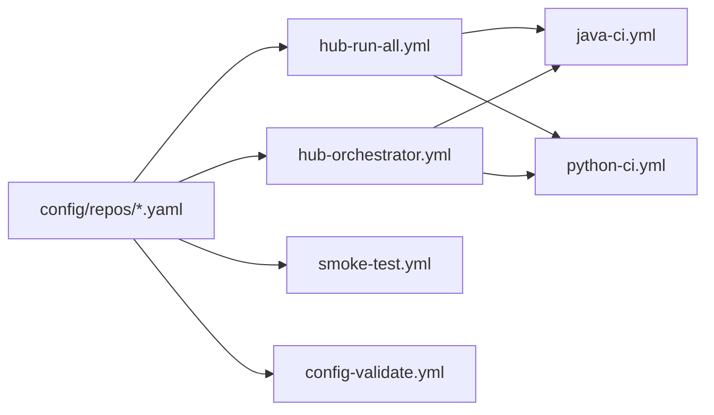

# CI/CD Hub

Centralized CI/CD for many repositories without copying workflow files into every project. The hub pulls configs from `config/repos/*.yaml`, runs quality and security tools for Java and Python, and publishes reports in one place.

## What You Get
- Single source of truth for pipelines and thresholds
- Central execution (hub clones repos) and optional dispatch (target repo runs reusable workflows)
- Monorepo support via `repo.subdir`
- Profiles and templates for fast, quality, security, minimal, coverage-gate, and compliance modes
- Schema-validated configs with defaults and opt-in heavy tools
- Fixture repos for continuous smoke coverage

## Architecture



## Workflows

| Workflow | Purpose | Trigger |
|----------|---------|---------|
| `hub-run-all.yml` | Central mode: clone each repo, run all tools, upload reports | push to main, schedule, manual |
| `hub-orchestrator.yml` | Dispatch mode: trigger reusable workflows (`hub-*.yml`) in target repos | manual |
| `smoke-test.yml` | Sanity check fast profiles against fixture repos | manual |
| `config-validate.yml` | Validate `config/repos/*.yaml` against schema | push/PR |
| `java-ci.yml` / `python-ci.yml` | Reusable workflows for dispatch mode | called by orchestrator |

## Running the Hub (central mode)
```bash
# All repos
gh workflow run hub-run-all.yml -R jguida941/ci-cd-hub

# Only fixtures or smoke sets
gh workflow run hub-run-all.yml -R jguida941/ci-cd-hub -f run_group=fixtures
gh workflow run hub-run-all.yml -R jguida941/ci-cd-hub -f run_group=smoke

# Single repo
gh workflow run hub-run-all.yml -R jguida941/ci-cd-hub -f repos=java-spring-tutorials
```

### Dispatch mode (optional)
1) Create a PAT with scopes `repo` and `workflow`.  
2) Add it as secret `HUB_DISPATCH_TOKEN` in the hub repo.  
3) Ensure the target repo has a thin caller workflow (`.github/workflows/hub-python-ci.yml` or `hub-java-ci.yml`) pointing to `@v1`.  
4) Set `repo.dispatch_workflow: hub-python-ci.yml` (or `hub-java-ci.yml`) in `config/repos/<repo>.yaml` and `dispatch_enabled: true`.  
5) The orchestrator defaults to `hub-*.yml` and falls back only if a different `dispatch_workflow` is set.

## Adding a Repository
Create `config/repos/<name>.yaml`:
```yaml
repo:
  owner: jguida941
  name: ci-cd-hub-fixtures
  language: python
  default_branch: main
  subdir: python-passing          # optional for monorepos
  dispatch_enabled: false         # central mode only
  run_group: fixtures             # full | fixtures | smoke

python:
  version: "3.12"

thresholds:
  coverage_min: 70
  mutation_score_min: 70
```

## Fixtures and Smoke Tests
- Fixtures repo: `jguida941/ci-cd-hub-fixtures` with subdirs `python-passing`, `python-failing`, `python-with-docker`, `java-passing`, `java-failing`, `java-with-docker`.
- Smoke configs use `run_group: smoke`. Fixtures use `run_group: fixtures`.
- Use `run_group` input on `hub-run-all.yml` to avoid unintentionally running every set.

## Reports and Artifacts
- Report schema: `schema_version: "2.0"` with `tool_metrics` and `tools_ran` objects. Use `scripts/validate_report.sh` (`--stack python|java`, `--expect-clean|--expect-issues`) to validate `report.json`.
- Job names and artifacts include config basename and subdir to disambiguate duplicate repos.
- Uploaded artifacts include test results, coverage, mutation, dependency, static analysis, and Semgrep/Trivy outputs.
- Mutation testing:
  - Java: runs PITest across all modules containing the plugin; aggregates all `mutations.xml` files.
  - Python: runs mutmut with coverage-driven selection; reports killed/survived counts.

## Documentation
Documentation is under `docs/` with the structure:
```
docs/
├── guides/        # ONBOARDING, WORKFLOWS, MODES, MONOREPOS, DISPATCH_SETUP, TROUBLESHOOTING
├── reference/     # CONFIG_REFERENCE, TOOLS, example.ci-hub.yml
├── development/   # ROADMAP, RESEARCH, SMOKE_TEST*, audit
├── adr/           # Architecture decisions
└── README.md      # Docs index
```

Start with `docs/guides/ONBOARDING.md`, `docs/guides/WORKFLOWS.md`, and `docs/reference/CONFIG_REFERENCE.md`.

## Support
Open issues in `ci-cd-hub` with run URLs and the config file you used. Include whether you ran central (`hub-run-all.yml`) or dispatch (`hub-orchestrator.yml`).
