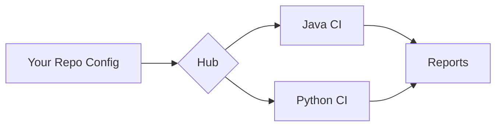

# CI/CD Hub

> Centralized CI/CD orchestration for Java and Python repositories. Run quality tools across many repos from one hub - target repos stay clean.

[](https://github.com/jguida941/ci-hub-orchestrator/actions/workflows/hub-run-all.yml)
[](https://github.com/jguida941/ci-hub-orchestrator/actions/workflows/config-validate.yml)
[](https://github.com/jguida941/ci-hub-orchestrator/actions/workflows/smoke-test.yml)
[](LICENSE)
[](https://www.python.org/)
[](https://openjdk.org/)
[](https://github.com/jguida941/ci-hub-orchestrator/issues)
[](https://github.com/jguida941/ci-hub-orchestrator/commits/main)

---

## Overview

The CI/CD Hub provides a single place to run builds, tests, code quality, and security scans across multiple repositories without cluttering target repos with workflow files.

### Key Features

- **Multi-repo orchestration** - Run CI for many repos from one central hub
- **Two execution modes** - Central (hub clones repos) or Distributed (dispatch to repo workflows)
- **14 pre-built profiles** - Fast, quality, security, minimal, coverage-gate, compliance
- **Monorepo support** - Target subdirectories within repos via `repo.subdir`
- **Schema-validated configs** - JSON Schema validation with clear error messages
- **Comprehensive tooling** - 11 Java tools, 13 Python tools (+7 planned)

---

## How It Works



1. **Configure** - Add `config/repos/your-repo.yaml` with repo details and tool toggles
2. **Run** - Hub executes `hub-run-all.yml` (clones your repo) or dispatches to your repo
3. **Analyze** - Java/Python pipelines run 20+ quality tools (coverage, linting, security, etc.)
4. **Report** - Artifacts, summaries, and metrics uploaded to GitHub Actions

---

## Tools

### Java Tools

| Category | Tool | Purpose | Default |
|----------|------|---------|---------|
| **Testing** | JUnit | Unit test framework | Built-in |
| **Coverage** | JaCoCo | Line/branch coverage | Enabled |
| **Style** | Checkstyle | Code style enforcement | Enabled |
| **Bugs** | SpotBugs | Static bug detection | Enabled |
| **Bugs** | PMD | Code smell detection | Enabled |
| **Security** | OWASP Dependency-Check | Vulnerability scanning | Enabled |
| **Mutation** | PITest | Mutation testing | Disabled* |
| **SAST** | Semgrep | Pattern-based security | Disabled* |
| **Container** | Trivy | Container/filesystem scan | Disabled* |
| **SAST** | CodeQL | Semantic code analysis | Disabled* |
| **Build** | Docker | Container build/test | Disabled |

### Python Tools

| Category | Tool | Purpose | Default |
|----------|------|---------|---------|
| **Testing** | pytest-cov | Test coverage | Enabled |
| **Testing** | Hypothesis | Property-based testing | Enabled |
| **Linting** | Ruff | Fast linter (replaces flake8) | Enabled |
| **Format** | Black | Code formatter | Enabled |
| **Format** | isort | Import sorting | Enabled |
| **Security** | Bandit | Security linter | Enabled |
| **Security** | pip-audit | Dependency vulnerabilities | Enabled |
| **Types** | mypy | Static type checking | Disabled |
| **Mutation** | mutmut | Mutation testing | Disabled* |
| **SAST** | Semgrep | Pattern-based security | Disabled* |
| **Container** | Trivy | Container/filesystem scan | Disabled* |
| **SAST** | CodeQL | Semantic code analysis | Disabled* |
| **Build** | Docker | Container build/test | Disabled |

> *Disabled by default due to longer execution time. Enable in config when needed.

### Planned Tools (Future Releases)

| Category | Tool | Language | Status |
|----------|------|----------|--------|
| **Property Testing** | jqwik | Java | Planned |
| **Mutation** | cosmic-ray | Python | Planned |
| **DAST** | OWASP ZAP | All | Planned |
| **Load Testing** | k6 | All | Planned |
| **Load Testing** | Gatling | Java | Planned |
| **Load Testing** | JMeter | Java | Planned |
| **Load Testing** | Locust | Python | Planned |

---

## Profiles

Pre-configured tool sets for common scenarios:

| Profile | Java | Python | Description |
|---------|------|--------|-------------|
| **fast** | `java-fast.yaml` | `python-fast.yaml` | Core tools only, fastest execution |
| **quality** | `java-quality.yaml` | `python-quality.yaml` | All quality tools enabled |
| **security** | `java-security.yaml` | `python-security.yaml` | Security-focused (OWASP, Bandit, etc.) |
| **minimal** | `java-minimal.yaml` | `python-minimal.yaml` | Build + test only |
| **coverage-gate** | `java-coverage-gate.yaml` | `python-coverage-gate.yaml` | Strict coverage thresholds |
| **compliance** | `java-compliance.yaml` | `python-compliance.yaml` | Full audit trail |

Apply a profile:
```bash
python scripts/apply_profile.py templates/profiles/java-fast.yaml config/repos/my-repo.yaml
```

---

## Workflows

| Workflow | File | Purpose | Trigger |
|----------|------|---------|---------|
| **Hub Run All** | `hub-run-all.yml` | Central execution for all configured repos | Manual, Schedule, Push |
| **Hub Orchestrator** | `hub-orchestrator.yml` | Dispatch to target repo workflows | Manual |
| **Hub Security** | `hub-security.yml` | Security-focused scanning | Manual, Schedule |
| **Java CI** | `java-ci.yml` | Reusable Java pipeline | `workflow_call` |
| **Python CI** | `python-ci.yml` | Reusable Python pipeline | `workflow_call` |
| **Smoke Test** | `smoke-test.yml` | Validation with fixture repos | Manual, PR |
| **Config Validate** | `config-validate.yml` | Schema validation | Push, PR |

---

## Quick Start

### 1. Add a Repository (Central Mode)

Create `config/repos/my-repo.yaml`:

```yaml
repo:
  owner: your-username
  name: your-repo
  language: java          # or python
  default_branch: main
  # subdir: services/api  # for monorepos
```

### 2. Apply a Profile (Optional)

```bash
# Start with a fast profile
python scripts/apply_profile.py templates/profiles/java-fast.yaml config/repos/my-repo.yaml

# Validate
python scripts/validate_config.py config/repos/my-repo.yaml
```

### 3. Run the Hub

```bash
gh workflow run hub-run-all.yml
```

---

## Configuration

### Config Hierarchy

Configs merge with this precedence (highest wins):

```
1. Target repo's .ci-hub.yml     (repo-local overrides)
2. Hub's config/repos/<name>.yaml (hub-side per-repo)
3. Hub's config/defaults.yaml     (global defaults)
```

### Tool Toggle Pattern

```yaml
java:
  tools:
    jacoco:
      enabled: true
      min_coverage: 80
    pitest:
      enabled: false  # expensive, enable when needed
```

---

## Scripts

| Script | Purpose |
|--------|---------|
| `apply_profile.py` | Apply/merge a profile into a repo config |
| `validate_config.py` | Validate config against JSON schema |
| `load_config.py` | Load and merge config hierarchy |
| `aggregate_reports.py` | Aggregate reports from multiple repos |
| `verify-smoke-test-setup.sh` | Verify smoke test configuration |

---

## Project Structure

```
hub-release/
├── .github/workflows/     # 7 workflows (hub-run-all, orchestrator, security, etc.)
├── config/
│   ├── defaults.yaml      # Global tool defaults
│   ├── repos/             # Per-repo configurations
│   └── optional/          # Optional feature configs
├── docs/
│   ├── guides/            # User guides (ONBOARDING, WORKFLOWS, etc.)
│   ├── reference/         # Reference docs (CONFIG_REFERENCE, TOOLS)
│   ├── development/       # Internal docs (ROADMAP, RESEARCH)
│   └── adr/               # Architecture Decision Records (9 ADRs)
├── templates/
│   ├── profiles/          # 14 pre-built profiles
│   ├── hub/config/repos/  # Hub config templates
│   └── repo/              # Repo-local config template
├── scripts/               # 5 utility scripts
├── schema/                # JSON Schema definitions
└── requirements/          # P0/P1 acceptance criteria
```

---

## Documentation

| Category | Documents |
|----------|-----------|
| **Getting Started** | [ONBOARDING](docs/guides/ONBOARDING.md), [MODES](docs/guides/MODES.md) |
| **Guides** | [WORKFLOWS](docs/guides/WORKFLOWS.md), [TEMPLATES](docs/guides/TEMPLATES.md), [MONOREPOS](docs/guides/MONOREPOS.md), [TROUBLESHOOTING](docs/guides/TROUBLESHOOTING.md) |
| **Reference** | [CONFIG_REFERENCE](docs/reference/CONFIG_REFERENCE.md), [TOOLS](docs/reference/TOOLS.md) |
| **Development** | [ROADMAP](docs/development/ROADMAP.md), [RESEARCH](docs/development/RESEARCH.md) |
| **ADRs** | [9 Architecture Decision Records](docs/adr/) |

---

## Related Repositories

| Repository | Purpose |
|------------|---------|
| [ci-hub-orchestrator](https://github.com/jguida941/ci-hub-orchestrator) | This hub (production) |
| [ci-cd-hub-fixtures](https://github.com/jguida941/ci-cd-hub-fixtures) | Test fixtures (java/python passing/failing) |

---

## License

MIT
